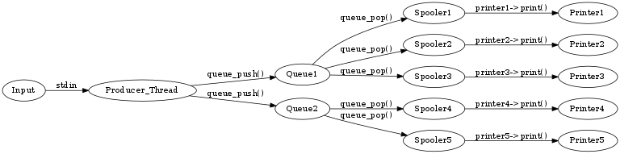

#Memory management with threads
In the previous lab, the subjects of creating and joining threads were explored.  There are quite a few applications that these ideas could be applied to, but these applications are not exactly the most interesting.  Most applications that do interesting things that use threading will most likely have to share variables between threads at some point.  This lab will cover the subject of how to share information & variables between threads in a way that produces the desired result.

#If you like it, then you shoulda put a mutex_lock on it
For the task in the previous lab, there was no reason for variables & information to be shared between multiple threads as
each thread computed its own value in the result matrix without need of input from another thread.  Though great, it’s not a
very interesting problem to solve.  For more interesting problems, there is a need to share memory between threads.  One
example of such an interesting problem would be calculating the standard deviation of a distribution.  The program to do that
is as follows:

~~~c
#include <stdio.h>
#include <stdlib.h>
#include <pthread.h>
#include <errno.h>
#include <math.h>

float Vals[1000];

//typedef for the struct to be the argument for calcAverage
typedef struct{
	float **s;
	int tid;
}sumArgs;

//typedef for the struct to be the argument for calcStandardDev
typedef struct{
	float **s;
	float avg;
	int tid;
}stdArgs;

void *calcAverage(void *param){
	sumArgs *args = (sumArgs *)param;
	while(args->tid < 1000){
		args->s[0][0] += Vals[args->tid];
		args->tid += 8;
	}
}

void *calcStandardDev(void *param){
	stdArgs *args = (stdArgs *)param;
	while(args->tid < 1000){
		args->s[0][0] += powf((Vals[args->tid] - args->avg), 2.f);
		args->tid += 8;
	}
}

int main(int argc, char** argv){
	pthread_t threads[8];
	sumArgs *avgCalcArgs = malloc(8 * sizeof(sumArgs));
	if(avgCalcArgs == NULL){
		perror("Malloc encountered an error");
		exit(1);
	}
	stdArgs *stdCalcArgs = malloc(8 * sizeof(stdArgs));
	if(stdCalcArgs == NULL){
		perror("Malloc encountered an error");
		exit(1);
	}
	float *sum = malloc(sizeof(float));
	if(sum == NULL){
		perror("Malloc encountered an error");
		exit(1);
	}
	float avg;
	float e_sum = 0.f;
	float e_avg = 0.f;
	float e_std;
	int i;
	int err;

	sum[0] = 0.f;

	srand(7);

	for(i = 0; i < 1000; i++){
		Vals[i] = (float)(rand() % 15);
		printf("%f\n", Vals[i]);
	}

	for(i = 0; i < 8; i++){
		avgCalcArgs[i].s = &sum;
		avgCalcArgs[i].tid = i;
		err = pthread_create(&threads[i], NULL, calcAverage, (void *)&avgCalcArgs[i]);
		if(err != 0){
			errno = err;
			perror("pthread_create");
			exit(1);
		}
	}

	for(i = 0; i < 8; i++){
		err = pthread_join(threads[i], NULL);
		if(err != 0){
			errno = err;
			perror("pthread_join");
			exit(1);
		}
	}

	for(i = 0; i < 1000; i++){
		e_sum += Vals[i];
	}

	printf("e_sum: %f\tsum: %f\n", e_sum, sum[0]);

	avg = sum[0] / 1000.f;
	e_avg = e_sum / 1000.f;

	printf("e_avg: %f\t\tavg: %f\n", e_avg, avg);

	sum[0] = 0.f;
	e_sum = 0.f;
	for(i = 0; i < 8; i++){
		stdCalcArgs[i].s = &sum;
		stdCalcArgs[i].tid = i;
		stdCalcArgs[i].avg = avg;
		err = pthread_create(&threads[i], NULL, calcStandardDev, (void *)&stdCalcArgs[i]);
		if(err != 0){
			errno = err;
			perror("pthread_create");
			exit(1);
		}
	}

	for(i = 0; i < 8; i++){
		err = pthread_join(threads[i], NULL);
		if(err != 0){
			errno = err;
			perror("pthread_join");
			exit(1);
		}
	}

	for(i = 0; i < 1000; i++){
		e_sum += powf(Vals[i] - e_avg, 2.f);
	}

	printf("e_sum: %f\tsum: %f\n", e_sum, sum[0]);

	avg = sqrtf(sum[0] / 1000.f);
	e_avg = sqrtf(e_sum / 1000.f);

	printf("e_std: %f\tstd: %f\n", e_avg, avg);

	free(avgCalcArgs);
	free(stdCalcArgs);
	free(sum);
	
	return 0;
}
~~~

Save this code snippet as `std_dev_calc.c`, compile it with the `-lm` flag to link against the math library, and run the program a couple of times, observe the outputs and answer the following questions:

- what is the expected output?
- what is the calculated output?
- what caused the discrepancy between the expected and calculated values?

##Ride into the critical section
One way to avoid the error that occurs in the calculation of the average and standard deviation is for the individual threads to lock the area of code where the accumulation of `sum` is performed, and unlock it once the accumulation is complete for that individual thread.  This area is known as the critical section.  To maximize performance, it is preferred that the critical section is as small as possible.  To perform these locks, the following lines of code are needed:

~~~c
pthread_mutex_t lock;
void *threadFunction(void *args){
.
.
.
pthread_mutex_lock(&lock);
//start of critical section
.
.
.
//end of critical section
pthread_mutex_unlock(&lock);
.
.
.
}
int main(int argc, char** argv){
.
.
.
err = pthread_mutex_init(&lock, NULL);
.
.
.
err = pthread_mutex_destroy(&lock);
return 0;
}
~~~

For more information regarding the init, lock, and unlock calls, consult `man 3 pthread_mutex_init`, `man 3 pthread_mutex_lock`, and `man 3 pthread_mutex_unlock` respectively.  As seen above, the variable `lock` is declared as a global variable so that all the threads can get access to it.  It is initialized in the main thread using `pthread_mutex_init`, and the threads use it to lock critical sections using `pthread_mutex_lock`.  Once the critical section is complete, the critical section is unlocked using `pthread_mutex_unlock`. Finally, before the program exits, destroy the mutex using the `pthread_mutex_destroy` function call.

Now, add the mutex and the calls to `pthread_mutex_lock` and `pthread_mutex_unlock` to the averaging and standard deviation calculation thread functions in `std_dev_calc.c`, compile it, run it, and answer the following questions:

- Did this fix the issue with the original code?

#See the threads in the streets, with not enough to do
Using mutexes to lock and unlock are great for avoiding race conditions, like what was shown in `std_dev_calc.c`, but it doesn't do a very good job of keeping threads from executing when we do not want them to.

Suppose that a program has a thread that takes in data from some outside source, performs some preprocessing on it, and places it into a queue for other threads in the program to perform some computations on it.  We will call this thread the producer thread.  The other threads that read from the queue and performs computations on that data will be called consumer threads.  To ensure correctness of the program and to avoid duplicit computations, the critical sections of the program should be when the producer thread writes elements to the queue and when the consumer threads read from the queue.  This would work fine, but there is a problem.  Suppose that the program has one producer thread with two consumer threads.   Suppose that during execution, the producer thread attempts and gets the mutex first, writes to the queue, and releases the mutex.  Then the first consumer thread attempts and gets the mutex next, reads from the queue, and releases the mutex. Then the second consumer thread does the same thing, but this time the queue is empty, so it can't do anything, and releases the mutex.  Suppose further that by the time the second consumer thread releases the mutex, the first consumer thread completes its computation and is attempting to read from the queue.  It gets the mutex, sees that the queue is empty, so it also releases the mutex.  Now, due to how the scheduling of the threads are, the producer thread performs the check of the mutex whenever one of the consumer threads has it, and it cannot lock the queue so that it can write to it.  This situation is known as starvation.  Since that is not desirable, conditional variables and semaphores should be used to avoid starvation.

##Waiting on the conditional variable to change
Conditional variables are used to ensure that threads wait until a specific condition occurs.  Using the example presented in the previous section, answer the following questions:

- What is the minimum number of conditions needed for the example to work as intended?
- What would those conditions be, and which thread(producer or consumer) should wait on that condition?
 
To use conditional variables, the following function calls are needed:

~~~c
#include <pthread.h>

int test_var;
pthread_cond_t generic_condition;
pthread_mutex_t lock;

void *genericThread0(void *args){
  pthread_mutex_lock(&lock);
  //do awesome stuff
  pthread_cond_signal(&generic_condition);
  test_var = 1;
  pthread_mutex_unlock(&lock);
}

void *genericThread1(void *args){
  pthread_mutex_lock(&lock);
  while(test_var == 0){
    pthread_cond_wait(&generic_condition, &lock);
  }
  //does fun things
  pthread_mutex_unlock(&lock);
}
.
.
.
int main(int argc, char **argv){
  int test_var = 0;
.
  err = pthread_mutex_init(&lock, NULL);
.
.
  err = pthread_cond_init(&generic_condition, NULL);
.
.
.
 err = pthread_cond_destroy(&generic_condition);
 return 0;
}
~~~

For more information regarding the cond\_init, cond\_wait, cond\_signal(and in extension cond\_broadcast), and cond\_destroy please consult `man 3 pthread_cond_init`, `man 3 pthread_cond_wait`, `man 3 pthread_cond_signal`, and `man 3 pthread_cond_destroy` respectively.  As can be seen above, the variable `generic_condition` is declared as a global variable for the same reason that `lock` is declared as a global variable.  `generic_condition` is then initialized in main by calling `pthread_cond_init`.  `genericThread0` locks the mutex, does what it's supposed to do, then sets `test_var` to `1`, so that `genericThread1` can break out of the loop, signals the conditional variable, then unlocks the mutex.  `genericThread1` will attempt to lock the mutex, test the value of `test_var`, and call `pthread_cond_wait` to see if the conditional variable has been signaled. If not, the thread will block, and `pthread_cond_wait` will not return. However, according to the man pages, this block does not last forever, and should be re-evaluated each time `pthread_cond_wait` returns; hence the `while` loop that surrounds the call to `pthread_cond_wait`.  If the conditional variable has been signaled, then `pthread_cond_wait` would return, and the thread calling it would get the mutex.  The value of `test_var` would then be tested, fall through, fun things are performed, and the mutex is unlocked.  Once all is said and done, remove the conditional variable using `pthread_cond_destroy`.

##Why not semaphore; you've got to declare yourself openly
Semaphores perform a similar task to conditional variables, and they are slightly easier to use.  Semaphores come it two flavors, Named, and Unnamed.  The differences between the two are in how they are created, and destroyed.  For simplicity, the unnamed flavor of semaphores will be covered in this handout.  To use semaphores, the following function calls and includes are needed:

~~~c
#include <semaphore.h>

sem_t semaphore;
.
.
.
void *genericThread0(void *args){
 pthread_mutex_lock(&lock);
 err = sem_wait(&semaphore);
 ...
 //do awesome stuff
 err = sem_post(&semaphore);
 ...
 pthread_mutex_unlock(&lock);
}

void *genericThread1(void *args){
 err = sem_wait(&semaphore);
 pthread_mutex_lock(&lock);
 ...
 //does fun stuff
 err = sem_post(&semaphore);
 ...
 pthread_mutex_unlock(&lock);
}

int main(int argc, char **argv){
 .
 .
 .
 err = sem_init(&semaphore, 0, 1);
 .
 .
 .
 err = sem_destroy(&semaphore);
 ...
 return 0;
}
~~~

For more information on the init, wait, post, and destroy functions, consult `man 3 sem_init`, `man 3 sem_wait`, `man 3 sem_post`, and `man 3 sem_destroy` respectively.  Note that the calls to`pthread_mutex_lock` and `pthread_mutex_unlock` do not necessarily have to be where they are shown in the above code, i.e., the mutex lock does not have to occur before the semaphore wait, and the mutex unlock doesn't have to occur after the semaphore post.  For similar reasons to `lock` and `generic_condition`, `semaphore` is declared as a global variable.  It is initialized in main using `sem_init` with the value for _pshared_ set to `0`(meaning the semaphore is only shared between the threads of the current process), and it's initial value will be `1`(last argument to `sem_init`).  `genericThread0` decrements semaphore by one using `sem_wait`. If `genericThread1` got to its `sem_wait` before `genericThread0` incremented the semaphore by calling `sem_post`, then `genericThread1` will block right at its `sem_wait` line.  Once everything is completed, destroy the semaphore by calling `sem_destroy` on `semaphore`.

#Tasks for this lab
This is week one of a three part lab assignment.  You will be expected to submit this week's work as normal with a lab report.  Next week's lab will build on the code you have written for this lab.  It is therefore in your best interest to write clean and portable code to minimize work in future labs.

##Print Server
This week's lab is to write a multi-threaded print server program.  The server will take in jobs from stdin in a Postscript format and print the files to PDF.  The layout of the program is one producer thread reading files from stdin and inserting the jobs into one of two queues.  Each queue has a set of consumer threads which will take the print jobs and print to PDF.  Since the printing takes time we will want to print multiple files at the same time; hence we are using multiple threads for this problem.  The overall flow is shown below:

The idea being simulated here is a single print server printing to a number of printers.  Each print job will request what type of printer it should be print on (e.g. color vs. black and white).  There may be multiple of a single type of printer; e.g. there could be three BW printers and one color, and a BW job could be printed to any BW printer.  For this first lab there is really only one type of printer (ps2pdf), but we are going to install this driver twice to simulate two different types of printers.  In a future lab we will expand this to additional types of printers.  To implement this define two print queues, one for each type of printer (pdf1, and pdf2) and install the pdf printer driver n1+n2 times, but allocate n1 to the pdf1 queue and n2 to the pdf2 queue.  This is explained in the code as well.

##Given Code
For this lab a large portion of the code is already written and supplied to you.  You will first need to read through the code provided in the `./src/` directory to understand what is already finished and what needs to be added.  You will also find, as is often the case when you are given code, that you will need to fix some of the given code to meet the project expectations.  For example, you will find that some of the errors are reported in a way that will not meet the --quiet command line flag you must support.  You should NOT change the existing API (i.e. the function prototypes or structure types) unless a comment tells you to do so.  If you do change you sould only add to maintain backwards compatability.  To help understand the code you can look at the doxygen generated comments.  To generate the documentation run `make doc` from inside the `src` directory.  The documentation can also be found at [http://cpre308.github.io/labs/Lab5/doc/html/index.html](http://cpre308.github.io/labs/Lab5/doc/html/index.html). 

Below is a brief description of each file.  You still should look through all of the code to make sure you understand what it is doing.

### main.c
This file is where the main function is along with the `printer_spooler` function.  `main` will act as the producer thread reading jobs from stdin and sending them to the print queues.  The `printer_spooler` function will be the consumer threads.  Each `printer_spooler` will be assigned a single printer to print to (created by calling `printer_install()`) and a print job queue.  The thead will be in an infinite loop pulling jobs off the queue and sending them to the printer.

### queue.c, queue.h
These two files are used for representing queues.  In this system a queue is a doubly linked list with functions to push and pop elements on both the head and tail of the list.  The student will need to fill in all of the `todo` sections of these files to add mutual exclusion to the list.  Look at the files for more information.  _Note_, currently the setup is to use semaphores to implement this functionallity.  If you would like you can change this to using condition variables instead, or you can stick with the semaphores.

### print_job.c, print_job.h
These two files represent a print job.  The function `print_job_create` creates a new print job object and allocates a temporary file in the `/tmp` directory.  The student is expected to fill in the `print_job_tostring` function, and should read through the rest to understand what is going on.

### printer.h
This file is the the public API of a printer driver.  Any print driver that is later used with this server will need to include this header.  In the next labs the student will write an additional print driver and load that driver into this program at runtime.  For now just pass `NULL` into the first param of `printer_install`.

### pdf_printer.c
This file is an example print driver for this print server.  For this week the student will just compile the driver into the program.  In a future lab this will be compiled seperately and loaded at runtime.  This is why the `print` and `uninstall` methods are accessed through the `printer_t` object.

### Makefile
Everything you have done for this class so far were simple one file programs.  This time the project is larger and being split into multiple files.  The supplied makefile will compile all of the source files and link them together to create a executable file.  You should look at the makefile, but you do not have to make any changes to it for this lab.  This make file can do the following:

~~~bash
# compile the code
$ make
# remove all binaries and object files
$ make clean
# generate the documentation
$ make doc
# make a single object file
$ make queue.o
~~~

## Input file format
The files to be printed will be supplied through stdin.  The streams will begin with several lines of header information, each starting with a `#` sign.  After the last header information the actual Postscript file will begin with at `%` sign.  The end of the Postscript file will end with a `%EOF`.  See the example files to understand the format, and the `main.c` file to find more information on how to parse the file.

## What you should do
First read all of the code and understand what it currently does and read the rest of this document.  Go through the code and fix all of the `todo` tags and implement the functionality of the program.  The provided test script only tests a very basic case; you should write a better test script that will test all of the features of the code.  You should write a report answering all questions in this lab write up and detailing how you solved this problem.  If you made any changes to the code explain what you changed and why.  Talk about any issues you ran into and how you overcame them.

## What to submit
Submit the following via GitHub:

- Any code you have written.
    - Your code should be well commented with doxygen style comment
    - Your code must be backwards compatible with the supplied API
- The test script you wrote to test and any additional files it takes (such as additional .ps files).
- Your lab report
- A README explaining how to use your test script
 
## Additional resources
The man pages are going to be your best friend for this lab.  In addition to the man pages, the following sites will also be helpful:

- [https://computing.llnl.gov/tutorials/pthreads/](https://computing.llnl.gov/tutorials/pthreads/)
- [https://www.gnu.org/software/libc/manual/pdf/libc.pdf](https://www.gnu.org/software/libc/manual/pdf/libc.pdf)
- [http://cpre308.github.io/labs/Lab5/doc/html/index.html](http://cpre308.github.io/labs/Lab5/doc/html/index.html)
- [https://gcc.gnu.org/onlinedocs/gcc-4.9.2/gcc.pdf](https://gcc.gnu.org/onlinedocs/gcc-4.9.2/gcc.pdf)

## Extra credit
There are a couple of ways to get extra credit for this lab.  One is to support additional printer drivers.  For example you could use ghostwriter to take in a Postscript file and output an ascii text file (`ps2ascii`).  Another way to get extra credit is to support additional **useful** command line arguments.  Please document any additional features in your lab report so the TAs know to grade them.

# License
This lab write up and all accompany materials are distributed under the MIT License.  For more information, read the accompaning LICENSE file distributed with the source code.

